<h1 align="center">Chem-eShop</h1>

[View the live project here](https://chem-eshop.herokuapp.com/)

At the beginning of the pandemic, as sellers of PPE, Chemstore Group set up an online ecommerce store on the Shopify platform. While the Shopify platform is great it has its limitations and costs.

My project features a full ecommerce store that allows users to view chemical safety products. Users are able to fiter them by category, sort by price, name, category, and then add to their bag and checkout securely.

Users can also leave reviews on products, sign up to our newsletter and contact us regarding a product.

## Index – Table of Contents
* [User Experience (UX)](#user-experience-ux) 
* [Features](#features)
* [Design](#design)
* [Planning](#planning)
* [Technologies Used](#technologies-used)
* [Testing](#testing)
* [Deployment](#deployment)
* [Credits](#credits)

## User Experience (UX)

### User stories :

  

    
Site User Stories

    - As a **site user** I want to be able to **register for an account** so that I can **have a personal account with my delivery details saved**

    - As a **site user** I want to be able to **login and logout** so that I can **access my profile info**

    - As a **site user** I want to be able to **receive an email confirmation after sign up** so that I can **verify my account registration was successful**

    - As a **site user** I want to be able to **have a personalised user profile** so that I can **view my order history and delivery information**

    - As a **site user** I want to be able to **leave a product review** so that I can **advise potential customers with my advise**

    - As a **site user** I want to be able to **sign up to a newsletter** so that I can **get the latest news and offers**

    - As a **site user ** I want to be able to **unsubscribe for the newsletter ** so that I can **stop receiving emails**

    - As a **site user** I can **return to Home after http 404 or 500 response** so that **I feel I am still working within the website and can navigate easily**

  

  

    
Shopper User Stories

    - As a **Shopper** I want to be able to **view a list of products** so that I can **select a product to purchase**

    - As a **shopper** I want to be able to **view individual products** so that I can **check price, description, images and sizes**

    - As a **shopper** I want to be able to **view my total cost** so that I can **I don't spend too much**

    - As a **shopper** I want to be able to **sort any list of products** so that I can **easily sort by price, best rated, etc**

    - As a **shopper** I want to be able to **sort products into categories** so that I can **split products into categories to make it easier to find what I want**

    - As a **shopper** I want to be able to **search a product by name** so that I can **easily find the product I am searching for**

    - As a **shopper** I want to be able to **select a specific size** so that I can **I can make sure the product will suit my needs**

    - As a **shopper** I want to be able to **view the items in my bag** so that I can **check out my bag contents and know exactly what I am buying**

    - As a **shopper** I want to be able to **adjust the quantity of items in my bag** so that I can **easily make changes**

    - As a **shopper** I want to be able to **enter my card details** so that I can **make a purchase**

    - As a **shopper** I want to be able to **view my order after I complete a purchase** so that I can **verify I have not made any mistakes**

    - As a **shopper** I want to be able to **receive an email confirmation after making a purchase** so that I can **keep the confirmation for any future needs**

    - As a **shopper** I want to be able to **contact Chemstore** so that I can **get in touch regarding a product/ issue, etc**

  

 

    
Admin Stories

    - As an **admin** I want to be able to **add a product** so that I can **I can add new products my store**

    - As an **admin** I want to be able to **edit a product** so that I can **make changes to any product**

    - As an **admin** I want to be able to **delete a product** so that I can **remove an item that is no longer for sale**

    - As an **admin** I want to be able to **view all messages from the contact form** so that I can **communicate with customers in a timely manner**

    - As an **admin** I want to be able to **view all messages from the contact form** so that I can **communicate with customers in a timely manner**

    - As an **admin** I want to be able to **view a list of subscribers in my admin** so that I can **see the amount of subscribers we have**

    - As an **admin** I want to be able to **export a CSV list of my subscribers** so that I can **can use them in marketing campaigns using tools like Mail Chimp**

  
    

## Features

### Existing Features

#### - Header

The header features the Chemstore logo, navigation for products in the centre and three icons to the right, a search icon, an account icon and a bag icon.

#### - Search Icon and Overlay

The search icon when clicked brings up a search input below, this can be used to search the site for all products. An autofocus was added so when the search icon is clicked the user's type is on the search input.

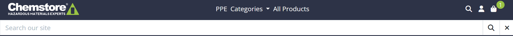

#### Account Dropdown

When clicked the account icon will display a dropdown list. Depending on the logged in status of the site user you will see different links. When the user is logged out they will see 'Register', 'Login' and 'Contact'. If the user is logged in they will see 'My Profile', 'Logout' and 'Contact'. Finally, if an admin user is logged in they will see 'Product Managment', 'My Profile', 'Logout' and 'Contact'.

#### Bag Notification

If the user currently has nothing in their bag they will just see a bag icon. If the user adds a product or products to their bag a green circle/ bubble will appear with the number of items in their bag.

#### Hero Section

The hero section is quite simple featuring an illustration of an ecommerce style image to the right and an a site intro on the left. The hero section also features a button to 'Shop Now' that takes the user to the all products page.

#### Product Categories

Below the hero section is a Product Categories section. This section features five cards with an image. Each card will grow on hover and when clicked will take the user to that product category.

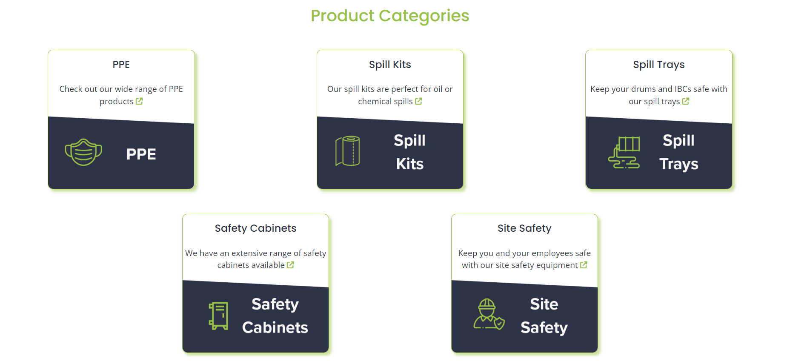

#### About Us Section

Next we have the about us section. Again, another simple section featuring a small word on the company on the right and an image of a chemical safety worker on the right.

#### Our Client Carousel

At the bottom of the homepage is a carousel style section featuring some of Chemstore's previous clients. This has been animated to automatically scroll across the screen.

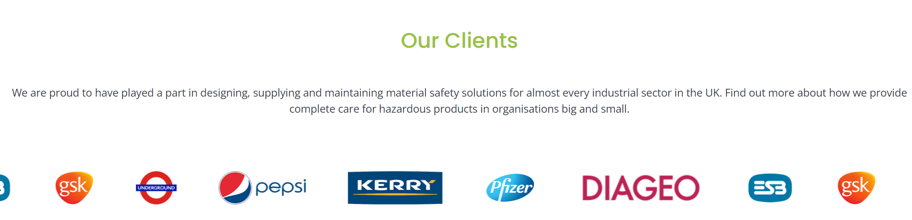

#### Footer

Finally the homepage features a footer. This footer is split into four sections. Firstly, the address section, then the products and account links. The fourth part of the footer features the Chemstore logo, a link to sign up to the newsletter below that and then social links.

There is also a link to the privacy policy at the bottom.

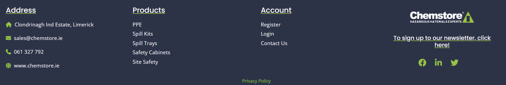

#### All Products Page

The all products page displays every product on the store as cards in rows of max 3. This page has a sort by field that allows a user to sort by price, name, rating and category. The produuct cards display the product image, title, price, rating and category below it.

If the user is an admin they will see two icon buttons to edit and delete a product.

#### Edit Product

This feature is only available to admin users, when the edit button is clicked whether from the products page or product detail page it will take you to the edit product page.

An alert displays to notify the admin that they are currently editing a product. The edit product page features a rich text editor thanks to django-ckeditor.

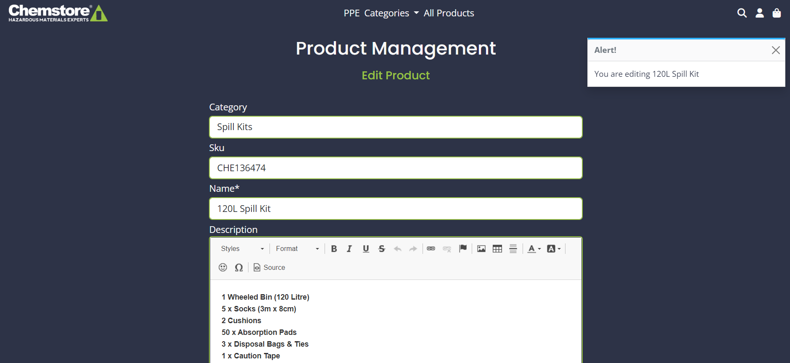

#### Delete Product

When the delete button is clicked the admin user will have a modal appear to confirm if the admin wants to delete the product.

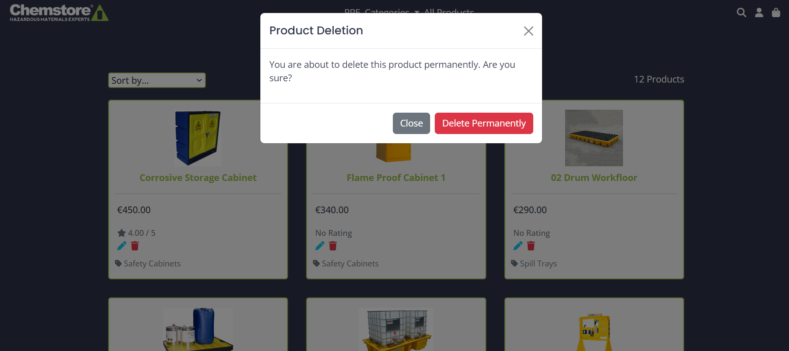

#### Product Detail Page

The product detail page features an image to the left and then on the right there is the product title, price, rating, description, the quantity and then two buttons 'Keep Shopping', that will take the user back to the products page. The 'Add to Bag' button will add the product to the user's bag.

If the user is an admin they will again see two icon buttons to edit and delete a product.

User Added to Bag:

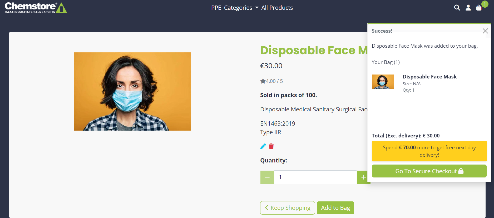

If the product has sizes a sizes option will also appear on the product detail page.

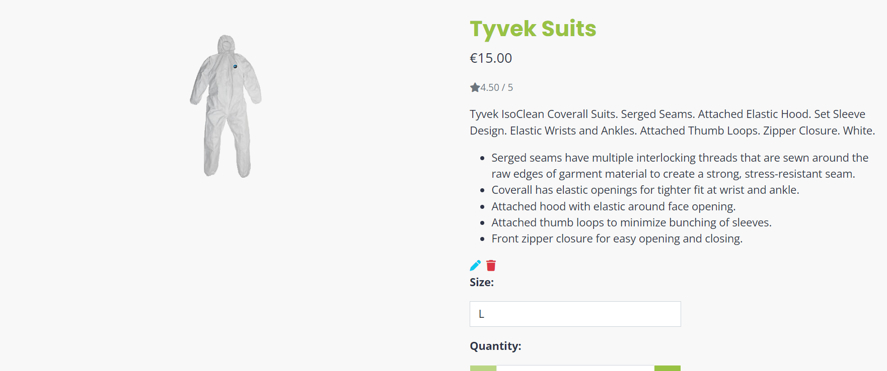

#### Product Reviews

Below the product container on the product detail page is the reviews section. When a user is signed in a product review form will show on the left side. The user reviews are then displayed on the right. These reviews have the review title, body, the user it was left by and the rating they gave.

Only the user that made the review has the ability to edit or delete it.

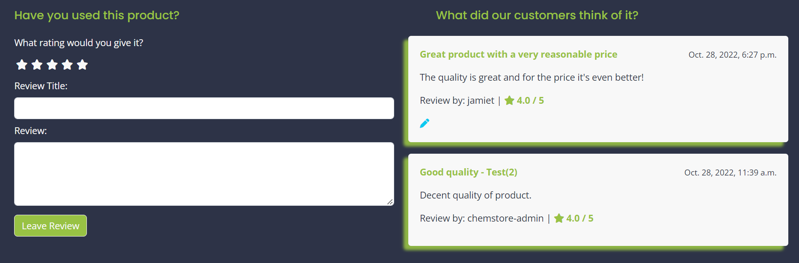

#### Edit Review Page

When the user clicks the edit button they are taken to a page with the edit form prefilled with their previous details. At the bottom there is two buttons. The first is to 'Delete Review', this will again take the user to a modal again to confirm delete. Then there is an 'Update Review' button that updates the review.

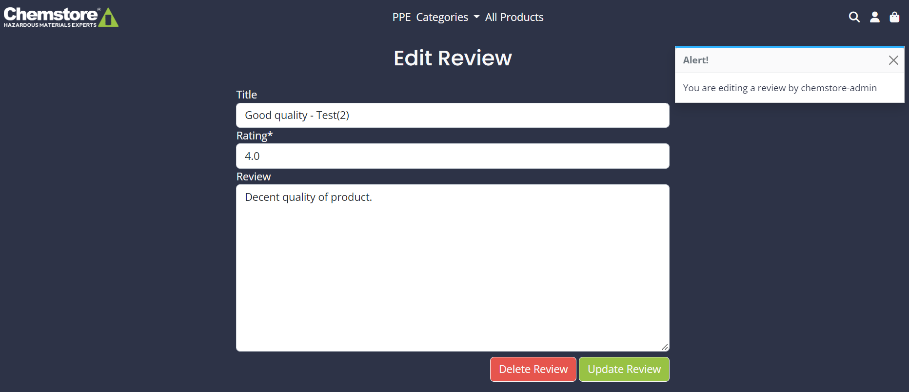

#### Add Product

As well as admin users having the ability to add products in the django admin they can also add them in the front end site. This page also features a rich text editor. 

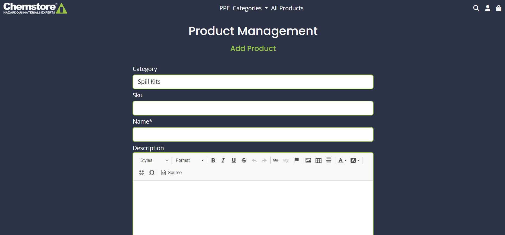

#### Bag Page

When the user is ready to progress on to the bag page they can either click the 'Go to Secure Checkout' button on the pop up that appears after adding an item to the bag or by clicking the bag icon.

The bag page features each product as displayed as a line item. The user can edit quantites or remove items from their bag with the buttons displayed.

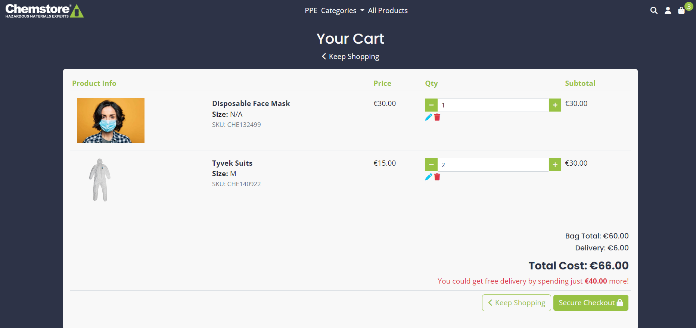

#### Checkout Page

The checkout page has a form to fill out the user's delivery details and card details. On the right is an order summary with the total cost.

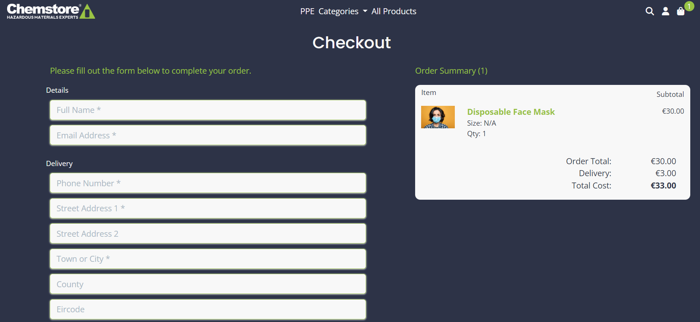

#### Checkout Success

Following a successful checkout process the user will be taken to a success screen. There is an alert with the confirmation number and email the confirmation was sent to. This page displays a summary of the order info, details, delivery details and the amount they were charged.

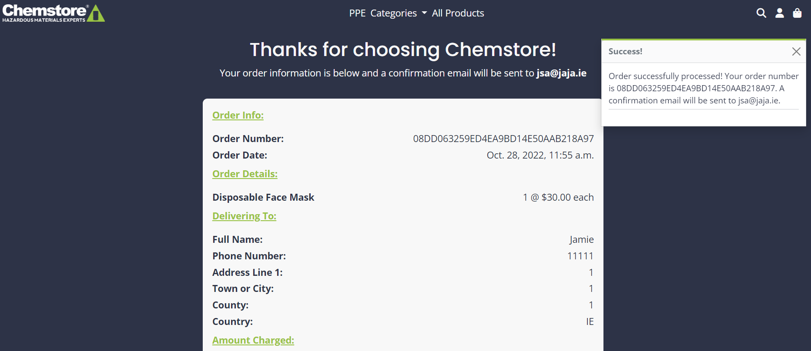

#### Profile Page

On the my profile page the logged in user can see their saved delivery details to the left and their order history on the right. Clicking the green highlighted order number will take the user to the order confirmation history with an alert that they are viewing an old order history.

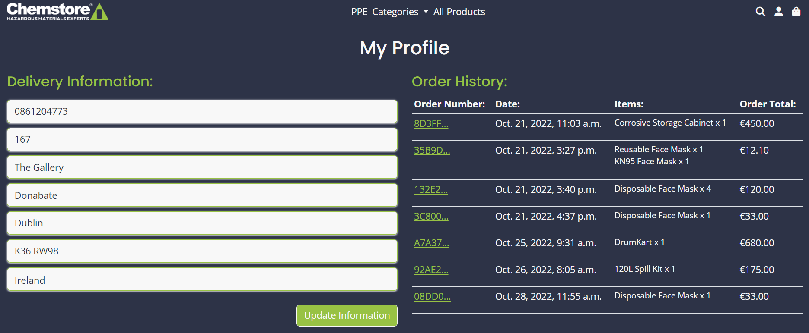

#### Contact Page

The contact page has an embedded Google Map on the left of the location of Chemstore. Next to it is a contact form with the option to select a product if their query relates to a particular product.

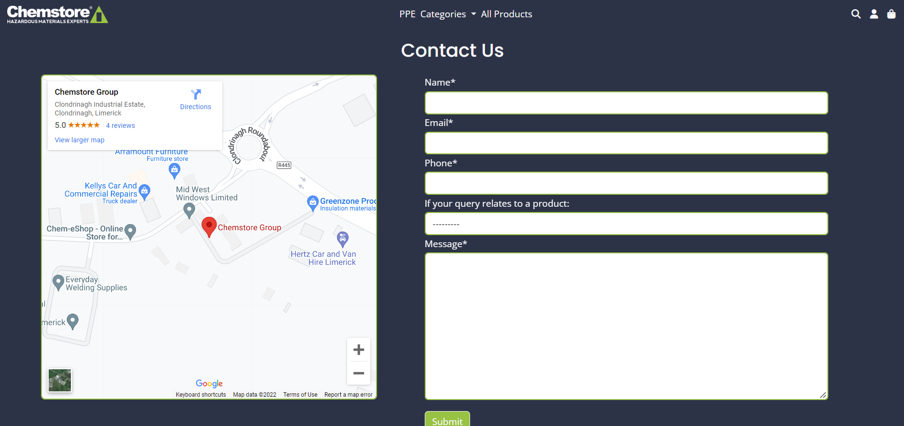

#### Newsletter Page

The newsletter sign up page features a simple input field for users to type their email address and be signed up. When submitted the user will get an alert saying that they are now signed up and receive a confirmation email.

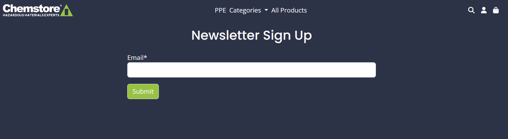

#### Unsubscribe Page

Near identical to the sign up page, the unsubscribe page has a single input field to delete their email address from our database. When submitted the user will get an alert saying that they are now unsubsribed and receive a confirmation email.

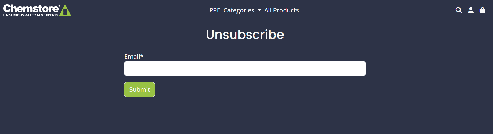

#### Newsletter Admin Page

When an admin user navigates to the user page he will also see an export button. When clicked a CSV file of all newsletter sign ups will be exported for use on Chemstore's email marketing service, Campaign Monitor.

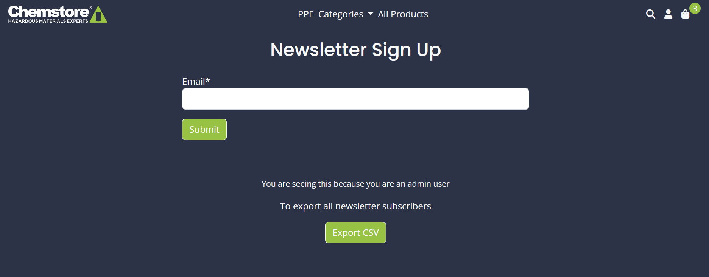

### Features which could be implemented in the future

## Design

### Wireframes

### Entity-Relationship diagram for DBMS

## Planning

## Technologies Used

### Languages Used

### Frameworks, Libraries & Programs Used  

## Testing

### Validator Testing 

### Manual Testing Test Cases and Results 

### Known bugs

## Deployment

## Credits 

### Code 

### Content 

### Media

### Acknowledgments